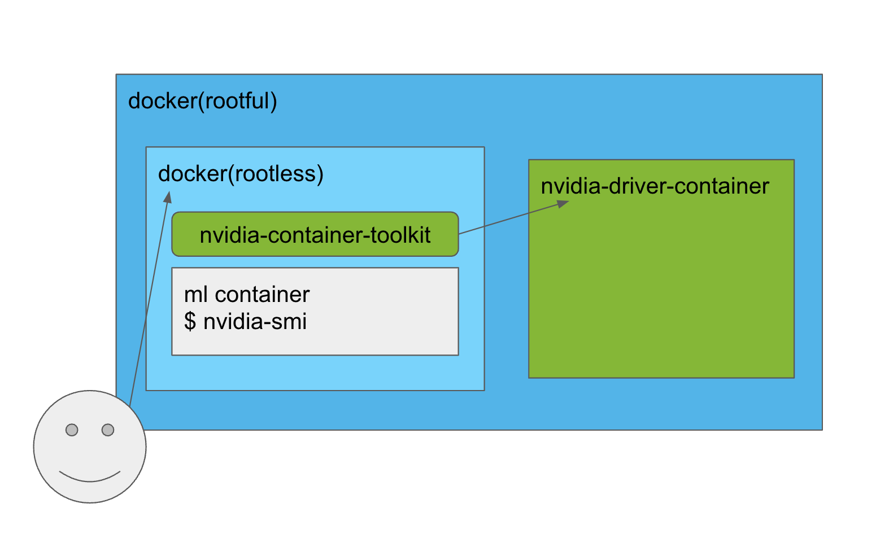

# docker-rootless-nvidia-stack
rootless docker + docker in docker + nvidia driver container



This repository was created to work with rootless docker and nvidia drivers. There is no installation on the host other than docker (rootful). Rootless Docker and Nvidia drivers both run as containers inside Docker. Users access the public rootless Docker by exposing a port or mounting a socket to the host.

## Deployment Example

```
# For example, we expose the port on localhost:2375.
$ cat << EOF >> docker-compose.yml
    ports:
    - 127.0.0.1:2375:2375
EOF
$ docker-compose up -d

# There is an initial wait time of 3 minutes to wait for the nvidia-driver to
# load. When looking at the log through the "docker-compose logs" command, if
# there are outputs like the following, the installation is complete.
$ docker-compose logs
nvidia-driver    | Done, now waiting for signal
...
dind-rootless    | time="2022-12-22T04:49:33.223259903Z" level=info msg="API listen on /run/user/100000/docker.sock"
dind-rootless    | time="2022-12-22T04:49:33.235296028Z" level=info msg="API listen on [::]:2375"
```

## User Example

```
# If you exposed the port above, you can access it through localhost.
$ docker -H localhost ps
CONTAINER ID   IMAGE     COMMAND   CREATED   STATUS    PORTS     NAMES
$ docker -H localhost run --rm --gpus all nvidia/cuda:11.6.2-base-ubuntu20.04 nvidia-smi
Thu Dec 22 04:52:12 2022
+-----------------------------------------------------------------------------+
| NVIDIA-SMI 525.60.13    Driver Version: 525.60.13    CUDA Version: 12.0     |
|-------------------------------+----------------------+----------------------+
...
+-------------------------------+----------------------+----------------------+

# or regular users, you can alias docker commands.
$ alias "docker=docker -H localhost"
$ docker ps
CONTAINER ID   IMAGE     COMMAND   CREATED   STATUS    PORTS     NAMES
```

## Troubleshooting

### driver is in use

The nvidia-driver container may throw an error like this:
```
Unloading NVIDIA driver kernel modules...
nvidia_uvm           1376256  0
nvidia_drm             73728  0
nvidia_modeset       1208320  1 nvidia_drm
nvidia              56131584  2 nvidia_uvm,nvidia_modeset
drm_kms_helper        311296  5 drm_vram_helper,ast,nvidia_drm
drm                   622592  8 drm_kms_helper,drm_vram_helper,ast,nvidia,drm_ttm_helper,nvidia_drm,ttm
Could not unload NVIDIA driver kernel modules, driver is in use
````
This is because the nvidia device is being used somewhere. (This includes drivers, nvidia-smi or nvidia persistence daemon, etc.) To clear all nvidia related packages and unload modules from the host, consider the following commands

```
sudo apt-get remove --purge '^nvidia-.*'
sudo modprobe -r nvidia_uvm
sudo modprobe -r nvidia_drm
sudo modprobe -r nvidia_modeset
sudo modprobe -r nvidia
```

If you still get an error that the same module is being used, it is recommended to reboot.
